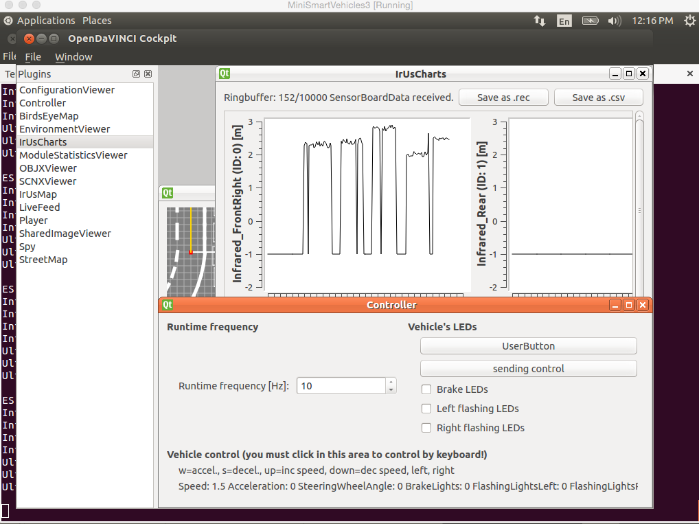

This tutorial explains how to use OpenDaVINCI for simulation and visualization (Ubuntu 14.04).

Installation
^^^^^^^^^^^

OpenDaVINCI has several extended libraries for simulation and visualization. The first extended library is odsimulation-odsimtools, which contains components such as odsimvehicle, odsimcamera, and odsimirus, for simulation. The second extended library is opendavinci-odcockpit used for visualization. odcockpit supports visualization for both simulation and real systems.

The tutorial on installing precompiled OpenDaVINCI libraries (http://opendavinci.readthedocs.org/en/latest/installation.pre-compiled.html#adding-opendavinci-to-your-ubuntu-14-04-linux-distribution) does not install these two libraries by default. In order to install odsimulation-odsimtools and opendavinci-odcockpit for simulation and visualization purposes, replace Step 4 at http://opendavinci.readthedocs.org/en/latest/installation.pre-compiled.html#adding-opendavinci-to-your-ubuntu-14-04-linux-distribution::

    $ sudo apt-get install opendavinci-lib opendavinci-odtools opendavinci-odsupercomponent

with::

    $ sudo apt-get install opendavinci-lib opendavinci-odtools opendavinci-odsupercomponent odsimulation-odsimtools opendavinci-odcockpit
    
After the installation, you will find all the OpenDaVINCI binaries (including binaries for simulation and visualization: odsimvehicle, odsimcamera, odsimirus, and odcockpit) in /usr/bin/.

Running the boxparker example in simulation
^^^^^^^^^^^^^^^^^^^^^^^^^^^^^^^^^^^^^^^^^^^^
The boxparker example demonstrates a self-parking algorithm in the OpenDaVINCI simulation environment. A tutorial on how to build the boxparker from sources and run it in Docker image can be found at https://github.com/se-research/OpenDaVINCI/tree/master/automotive/miniature/boxparker. This tutorial gives instructions on running boxparker in simulation without Docker. The boxparker example involves the execution of (1) odsupercomponent: the lifecycle management component of OpenDaVINCI; (2) odsimvehicle: for vehicle movement simulation; (3) odsimirus: for generating distances from obstacles in simulation; (4) odcockpit: the visualization tool; (5) boxparker: the boxparker application.

This tutorial assumes that (1) OpenDaVINCI has been installed at /opt/od/ after being built from sources; and (2) boxparker has been compiled by following https://github.com/se-research/OpenDaVINCI/tree/master/automotive/miniature/boxparker. Then the binaries of the first 4 components can be found at /opt/od/bin, while the boxparker binary should be at automotive/miniature/boxparker/build within the OpenDaVINCI source code folder.

First, download the configuration and scenario files from http://www.cse.chalmers.se/~bergerc/dit168/example.zip, including a configuration file used by odsupercomponent, and two scenario files Car1.objx and Parking_boxes.scnx. Copy these files to /opt/od/bin/ and then go to this directory::

	$ cd /opt/od/bin/
	
Run odsupercomponent::

	$ LD_LIBRARY_PATH=/opt/od/lib ./odsupercomponent --cid=111

In a new terminal, run odsimvehicle::

	$ LD_LIBRARY_PATH=/opt/od/lib ./odsimvehicle --cid=111 --freq=10
	
In a new terminal, run odsimirus::

	$ LD_LIBRARY_PATH=/opt/od/lib ./odsimirus --cid=111 --freq=10	
	
In a new terminal, run odcockpit::

	$ LD_LIBRARY_PATH=/opt/od/lib ./odcockpit --cid=111
	
In odcockpit window, open the BirdsEyeMap plugin. You will see a static car and its surroundings for parking.

Go to the boxparker binary directory and run boxparker in a new terminal::

	$ ./boxparker --cid=111 --freq=10
	
The car in the BirdsEyeMap window in odcockpit will start moving and stop after it successfully finds a parking slot. Meanwhile, you can open the IrUsMap window and IrUsCharts window on the left side to observe the infrared and ultrasonic sensor data readings.

Noise model for odsimirus
^^^^^^^^^^^^^^^^^^^^^^^^^^
OpenDaVINCI provides a noise model for the odsimirus component to test the robustness of an algorithm (e.g., lane following) in simulation. The noise model is specified in the configuration file for odsupercomponent. For instance, the following specifies the noise model for sensor 0:

- odsimirus.sensor0.faultModel.noise = 0.1
- odsimirus.sensor0.faultModel.skip = 0.05

The first parameter ranges from 0 to 1 and reflects an additional noise to be added from the range [-1,+1]. The implementation is at https://github.com/se-research/OpenDaVINCI/blob/master/libopendlv/src/model/PointSensor.cpp#L164.

The second parameter ranges from 0 to 1 and reflects the dropped frames/missing readings. The implementation is at https://github.com/se-research/OpenDaVINCI/blob/master/libopendlv/src/model/PointSensor.cpp#L187.

The figure below shows a visualization screenshot using the aforementioned parameters.

